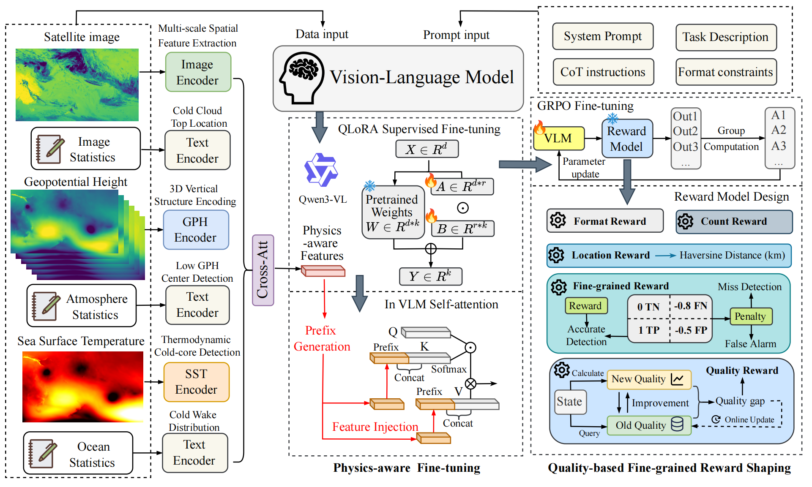

# TCG-LLM
This repo is for the paper TCG-LLM: Physics-aware Fine-tuning with Quality-based Reward Shaping for Tropical Cyclogenesis Detection and Localization.

## Introduction
In this paper, we propose the ***Tropical CycloGenesis Large Language Model (TCG-LLM)***, a multimodal large language model for basin-scale TCG detection and localization. We design a physics-aware fine-tuning strategy, using encoders based on convolutional neural networks to extract TC-specific physically meaningful features, which are injected in VLMs to guide the model to incorporate meteorological knowledge in fine-tuning. To improve generalization beyond training patterns, we further incorporate Group Relative Policy Optimization (GRPO) with quality-based reward shaping, using an online-learned quality function to provide dense intermediate learning signals that accelerate convergence and improve accuracy. We also apply fine-grained penalty on false negative cases to reduce miss TCG detections. We construct the ***Tropical Cyclogenesis Detection and Location Dataset (TCDLD)*** for evaluation. Experiments show that TCG-LLM reduces TC detection mean absolute error and localization mean distance error by 39.85% and 31.72%, respectively, compared with state-of-the-art baselines.

## Framework
<div align="center">
  
</div>

  The input of TCG-LLM consists of two parts: prompts and data, where the data component includes satellite images, geopotential height (GPH) data and sea surcface temperature (SST) data covering an entire ocean basin. For each type of data, we generate textual statistical descriptors and feed them to the VLM together with the corresponding images. We incorporate TC knowledge and design Image Encoder, GPH Encoder, and SST Encoder based on CNNs and attention mechanisms to extract visual physics-aware features. For the corresponding statistical descriptors, we design a Text Encoder to capture semantic information, and fuse textual and visual features via cross-attention, enabling the model to focus on image regions relevant to the text and improving visual understanding.   
  
  The VLM prompts consist of four components: (1) a system prompt that introduces the overall task, (2) a task description prompt that specifies the TCG detection and localization objective, (3) a chain-of-thought (CoT) prompt that encourages decomposing complex problems into intermediate steps to improve the accuracy and stability of multi-step reasoning, and (4) a format-constraint prompt that specifies the output formats to facilitate downstream parsing and evaluation.  
  
  The fine-tuning of TCG-LLM proceeds in two stages. First, we apply SFT to the VLM using Quantized Low-Rank Adaptation (QLoRA) PEFT. To incorporate TC physics during adaptation, we propose a physics-aware fine-tuning strategy that injects the CNN-encoder feature vectors into the self-attention computation, allowing the LLM to leverage physically informative representations throughout fine-tuning. Second, we further perform RL fine-tuning using GRPO. We adopt quality-based fine-grained reward shaping by augmenting the reward with an online-learned quality function, which provides intermediate signals that reflect the improvement of the current state, helping the model identify the direction and magnitude of updates more effectively and learn better strategies. 

## Repository Structure

```
├── cnn_encoders.py                         # Physics-aware CNN encoders 
├── prefix_injector.py                      # KV prefix injection module 
├── train_SFT.py                            # Stage 1: SFT training script 
├── train_GRPO.py                           # Stage 2: GRPO RL fine-tuning script
├── plot_overall.py                         # Overall error comparison visualization
├── plot_basinwise.py                       # Basin-wise performance comparison visualization
├── figures                                 # figures
├── results                                 # TCG detection and localization results of all 12 models on TCDLD test set
└── TCDLD/                                  # Dataset 
```

## TCDLD Dataset

We proposed Tropical Cyclogenesis Detection and Location Dataset ([TCDLD](https://drive.google.com/file/d/1-eVntCFSOM33fQk5lWpCWIgPQZfTKZaU/view?usp=sharing)) for the evaluation of TCG-LLM. TCDLD contains 18,679 samples from 2019 to 2026 with a temporal resolution of 12 hours, and each sample includes satellite imagery, GPH, SST, and corresponding textual statistical descriptors. The satellite imagery is sourced from Gridded Satellite ([GridSat-B1](https://www.ncei.noaa.gov/products/gridded-geostationary-brightness-temperature)). Ground-truth TC locations are obtained from International Best Track Archive for Climate Stewardship ([IBTrACS](https://www.ncei.noaa.gov/products/international-best-track-archive)). Both GPH and SST are derived from European Centre for Medium-Range Weather Forecasts Reanalysis 5 ([ERA5](https://cds.climate.copernicus.eu/datasets/reanalysis-era5-pressure-levels?tab=overview)). For each 12-hour time step, all ocean basins with active TCs are included; if fewer than 3 basins have TCs at a given time step, additional basins without TCs are randomly sampled to ensure at least 3 basins per time step. We split the dataset into training and test sets with a temporal buffer to prevent TC leakage: 12,344 samples from 2019-01-01 to 2023-06-22 are used for training, samples from 2023-06-23 to 2023-06-30 are excluded as a buffer period (to ensure no TC active during training appears in the test set; 2 TCs crossing the boundary dissipated by 2023-06-26), and 6,335 samples from 2023-07-01 to 2026-03-30 are used for testing. 

| Statistic | Value |
|-----------|-------|
| Total samples | 18,679 |
| Training samples | 12,344 (2019-01-01 to 2023-06-22) |
| Buffer period (excluded) | 2023-06-23 to 2023-06-30 |
| Test samples | 6,335 (2023-07-01 to 2026-03-30) |
| Positive (has TC) | 7,954 (43.2%) |
| Negative (no TC) | 10,469 (56.8%) |
| Ocean basins | EP, NA, NI, SI, SP, WP |
| Temporal resolution | 12 hours (00:00 / 12:00 UTC) |
| Total size | ~165 GB |

### Directory Structure

```
TCDLD/
├── image/          # Satellite brightness temperature images (.npy)
│                   #   18,423 files, ~45 GB
│                   #   Format: dict{'image': ndarray(H, W), float16}
│                   #   Typical shape: ~715×1786 (varies by basin)
│
├── gph/            # Geopotential height fields at 6 pressure levels (.npy)
│                   #   18,423 files, ~30 GB
│                   #   Format: ndarray(6, H, W), float16
│                   #   6 levels: 200, 500, 700, 850, 925, 1000 hPa
│
├── sst/            # Sea surface temperature fields (.npy)
│                   #   18,423 files, ~18 GB
│                   #   Format: ndarray(H, W), float16
│
├── label/          # Ground-truth labels from IBTrACS (.npy)
│                   #   18,423 files, ~18 GB
│                   #   Format: dict{
│                   #     'tc_count': int,
│                   #     'tc_positions': [(lat, lon), ...],
│                   #     'tc_sids': [str, ...],    # IBTrACS storm IDs
│                   #     'tc_msw': [float, ...]    # max sustained wind (kt)
│                   #   }
│
├── image_docs/     # Satellite image textual descriptors (.md)
│                   #   Cloud structure analysis, cold-cloud center detection,
│                   #   rotational symmetry, brightness temperature statistics
│
├── gph_docs/       # GPH textual descriptors (.md)
│                   #   Low geopotential height center detection at 500hPa,
│                   #   spatial variability analysis, gradient features
│
└── sst_docs/       # SST textual descriptors (.md)
                    #   Mean SST, warm pool coverage (>26.5°C),
                    #   cold-core detection with cooling amplitude
```

### Filename Convention

All files follow the pattern: `{YYYYMMDD}_{HHMM}_{BASIN}_{type}.{ext}`

- **Date/Time**: `20240915_0000` = September 15, 2024 at 00:00 UTC
- **Basin code**: `WP` (Western Pacific), `EP` (Eastern Pacific), `NA` (North Atlantic), `NI` (North Indian), `SI` (South Indian), `SP` (South Pacific)
- **Type**: `image`, `gph`, `sst`, `label`

Example: `20240915_0000_WP_image.npy` → Western Pacific satellite image on 2024-09-15 00:00 UTC

### Label Example

```python
# Sample with 3 active tropical cyclones (WP basin, 2024-09-15)
{
    'tc_count': 3,
    'tc_positions': [(29.7, 127.1), (12.1, 144.6), (16.7, 126.0)],
    'tc_sids': ['2024254N10148', '2024259N12145', '2024259N17126'],
    'tc_msw': [64.0, None, None]  # knots; None = intensity unavailable
}
```

## Results

We evaluate all models on the TCDLD test set (6,335 samples, 2023-07-01 to 2026-03-30). Detection performance is assessed using Hungarian matching with a 500 km threshold. **MR** (Miss Rate) = FN / (TP + FN), measuring the proportion of missed TCs. **FAR** (False Alarm Rate) = FP / (TP + FP), measuring the proportion of false detections.

| Model | Params | Count MAE ↓ | Count RMSE ↓ | MR ↓ | FAR ↓ | F1 ↑ | Dist. MAE (km) ↓ | Dist. RMSE (km) ↓ |
|-------|--------|-------------|--------------|------|-------|------|-------------------|---------------------|
| FPN | <0.1B | 0.552 | 0.781 | 48.01% | 62.56% | 43.54% | 156.4 | 178.3 |
| Mask R-CNN | <0.1B | 0.412 | 0.727 | 46.74% | 41.14% | 55.92% | 152.7 | 187.4 |
| GLM-4.5V | 106B | 0.346 | 0.630 | 36.26% | 35.91% | 63.91% | 106.8 | 129.3 |
| Qwen3-VL-235B | 235B | 0.359 | 0.610 | 21.34% | 39.48% | 68.41% | 101.1 | 124.3 |
| Gemini-3 Pro | - | 0.262 | 0.603 | 34.95% | 17.59% | 72.71% | 110.2 | 139.5 |
| Claude-Opus-4.5 | - | 0.253 | 0.622 | 26.31% | 23.99% | 74.83% | 100.4 | 129.3 |
| GPT-5.2 | - | 0.134 | 0.432 | 20.35% | 6.63% | 85.96% | 88.9 | 117.1 |
| Ministral 3 8B† | 8B | 0.182 | 0.461 | 24.90% | 11.72% | 81.16% | 89.8 | 112.5 |
| Qwen3-VL-8B† | 8B | 0.164 | 0.432 | 22.15% | 11.15% | 82.99% | 86.9 | 109.8 |
| Gemma 4 E4B† | 4B | 0.133 | 0.379 | 16.34% | 7.66% | 87.78% | 73.5 | 99.4 |
| Qwen3.5-9B† | 9B | 0.119 | 0.358 | 14.80% | 6.69% | 89.07% | 75.2 | 101.5 |
| **TCG-LLM** | **8B** | **0.080** | **0.301** | **8.54%** | **5.97%** | **92.73%** | **60.7** | **86.3** |

†: Fine-tuned with TCG-LLM vanilla SFT pipeline (without physics-guided encoders and GRPO). Qwen3-VL-8B serves as the vanilla SFT baseline.


## Encoder-level Ablation

We ablate each encoder individually while keeping the rest of the pipeline intact (SFT + GRPO):

| Configuration | CMAE↓ | F1↑ | MR↓ | DMAE↓ |
|---------------|-------|-----|-----|-------|
| w/o Satellite Image | 0.180 | 80.99% | 21.57% | 106.9 |
| w/o GPH | 0.130 | 86.67% | 16.01% | 89.2 |
| w/o SST | 0.109 | 90.23% | 11.87% | 69.7 |
| Full (TCG-LLM) | 0.080 | 92.73% | 8.54% | 60.7 |

- **Satellite imagery** contributes most (removing it degrades F1 by 11.74%), as it directly captures cloud-top spiral structures indicative of TC vortex formation.
- **GPH** is the second most impactful (F1 −6.06%): the GPH Encoder uses 3D convolutions over 6 pressure levels (200–1000 hPa) to capture **vertical wind shear** and **baroclinic instability** — key dynamical drivers of cyclogenesis not observable from imagery alone.
- **SST** provides complementary thermodynamic information (F1 −2.50%), enforcing the **warm-pool threshold** (≥26.5°C) necessary for TC genesis and detecting TC-induced **cold-core SST anomalies**.

## CoT Comparison: How Physics-guided Prefix Alters Reasoning

We compare the chain-of-thought reasoning on the same input with and without the physics-guided prefix injection (WP basin, 2024-09-15 00:00 UTC, GT: 3 TCs at (29.7°N, 127.1°E), (12.1°N, 144.6°E), (16.7°N, 126.0°E)):

**Without physics-guided prefix (vanilla SFT):**

> (1) The satellite image shows cloud clusters in the western Pacific. A prominent spiral cloud system is visible near 12°N, 145°E with deep convective features. Another cloud mass near 17°N, 126°E shows some cyclonic organization. A diffuse cloud system near 30°N appears to have weakened convective signatures, and the textual statistics report a relatively high GPH at this latitude, suggesting a non-tropical system. A broad cloud band extends near 8°N, 135°E.
> (2) Locating TC signatures: (a) The GPH statistics mention basin-level lows concentrated at lower latitudes; the 30°N region is not highlighted. (b) The SST statistics indicate basin-average SST of 28.9°C but do not provide a precise spatial pattern near 30°N. (c) From the satellite image, the spiral center near 12.2°N, 145.0°E is the most well-defined; the cloud mass near 17°N shows moderate curvature at (16.8°N, 125.9°E). The 30°N system is dismissed as likely extratropical. The broad cloud band near 8°N does not show a clear vortex center.
> (3) I identify 2 tropical cyclones.
> → **Prediction: count=2, positions: (12.3°N, 145.1°E), (16.5°N, 126.3°E)** ✗ Missed the TC at 29.7°N

**With physics-guided prefix (TCG-LLM):**

> (1) The satellite image shows three cloud clusters in the western Pacific. The cloud system near 12°N, 145°E exhibits clear spiral banding. Near 17°N, 126°E, another organized cluster is present with cyclonic curvature. Near 30°N, 127°E, a cloud system appears less organized in satellite imagery alone, but the geopotential height field reveals a closed low-pressure center at 500 hPa with a −42 gpm anomaly, and vertical wind shear between 200 and 850 hPa remains moderate at 12 m/s, indicating tropical rather than extratropical characteristics. A broad cloud band near 8°N, 135°E shows an elongated east–west pattern with no closed GPH contour at any level.
> (2) Locating TC signatures: (a) GPH minima are identified at three locations — 12.0°N/144.8°E (anomaly −68 gpm), 16.8°N/125.9°E (−55 gpm), and 29.6°N/127.0°E (−42 gpm). The 3D vertical structure at 29.6°N shows warm-core tilting consistent with a recurving TC. (b) SST values at all three locations (29.5°C, 27.8°C, 28.2°C) exceed 26.5°C, and cold-core SST anomalies of −1.2°C, −0.6°C, and −0.8°C confirm active ocean-atmosphere coupling. The cloud band near 8°N, 135°E lacks a localized SST cold-core signature and shows no cyclonic curvature, consistent with a monsoon trough rather than a developing TC. (c) The satellite spiral centers align with the GPH minima at approximately (12.1°N, 144.7°E), (16.6°N, 126.1°E), and (29.8°N, 127.2°E).
> (3) I identify 3 tropical cyclones.
> → **Prediction: count=3, positions: (29.8°N, 127.2°E), (12.1°N, 144.7°E), (16.6°N, 126.1°E)** ✓ All 3 detected

### Analysis:

Vanilla SFT's CoT Step (1) relies solely on satellite cloud morphology; its Step (2) can only reference basin-level textual statistics (e.g., "basin-average SST 28.9°C"), which lack the spatial resolution to distinguish localized TC signatures. This leads to two critical failures: **(a) no physical consistency verification** — without localized SST data, the model cannot verify whether thermodynamic conditions (SST ≥ 26.5°C) support TC genesis at specific candidate locations; **(b) inability to distinguish meteorological phenomena** — the model cannot differentiate between a genuine TC, a monsoon trough, an easterly wave, or a subtropical low based on morphology alone, causing it to both miss ambiguous TCs (the 30°N system) and fail to provide a principled basis for excluding non-TC features.

In contrast, TCG-LLM's physics-guided prefix injects the CNN-extracted physics directly into the self-attention computation: the prefix tokens act as implicit soft anchors encoding GPH vertical profiles and SST cold-core patterns at sub-basin resolution. This fundamentally changes the CoT reasoning in three ways:

1. **Step (1) gains physics-aware perception** — the model identifies the 30°N system not by cloud shape alone but by attending to prefix tokens that encode a closed 500 hPa GPH low (−42 gpm) and moderate vertical wind shear (12 m/s), correctly classifying it as tropical.
2. **Step (2) enforces physical consistency** — the model explicitly verifies that SST at each candidate TC location exceeds the **26.5°C thermodynamic threshold** for TC genesis, and confirms active ocean-atmosphere coupling through cold-core SST anomalies. This ensures predictions respect established physical constraints rather than relying on visual pattern matching alone.
3. **Step (2) enables meteorological phenomenon discrimination** — the model cross-references multiple physical indicators to distinguish genuine TCs from visually similar but dynamically different phenomena: a monsoon trough is correctly excluded because it shows no closed GPH contour, no localized SST cold-core anomaly, and no cyclonic curvature — a multi-source diagnosis that is impossible with satellite imagery alone.

This attention-level mechanism explains why removing GPH causes MR to nearly double (8.54% → 16.01% in the ablation table): without the GPH prefix tokens, Q vectors lose access to vertical structure information, and the model reverts to morphology-only reasoning that misses structurally ambiguous TCs. Similarly, removing SST eliminates the model's ability to enforce thermodynamic consistency, leading to increased false alarms at locations where SST conditions do not support TC genesis (FAR increases from 5.97% to 7.57%).

## Scripts

### 1. `cnn_encoders.py` — Physics-aware CNN Encoders 

Standalone CNN module containing:
- **`ImageEncoder`**: Multi-scale (3×3, 5×5, 7×7) convolution on satellite images with gradient channel augmentation
- **`GPHEncoder`**: 3D convolution + self-attention over 6 pressure levels for vortex pattern detection
- **`SSTEncoder` (ColdCoreDetector)**: Laplacian-based cold-core detection sensitive to TC-induced SST anomalies
- **`CrossAttentionModule`**: Cross-modal feature fusion
- **`FusionTransformer`**: Multi-layer Transformer encoder for unified representation
- **`JSONDecoder`**: Structured JSON output prediction (count + positions)

Can be trained independently as a CNN baseline:

```bash
python cnn_encoders.py
```

The trained checkpoint (`best.pt`) is used in Stage 1 & 2 for physics-aware prefix injection.

### 2. `prefix_injector.py` — KV Prefix Injection 

Lightweight module that projects CNN encoder outputs (768-dim fused vector) into KV prefix tokens injected into every VLM self-attention layer:

- Input: `z ∈ ℝ^{768}` (concatenation of image, GPH, SST encoder outputs, each 256-dim)
- Output: 128 prefix tokens as `(K, V)` pairs per attention layer
- Supports shared or per-layer prefix generation

### 3. `train_SFT.py` — Stage 1: SFT Training

Supervised fine-tuning of Qwen3-VL-8B with QLoRA and physics-aware prefix injection.

**Key hyperparameters:**

| Parameter | Value |
|-----------|-------|
| Base model | Qwen3-VL-8B-Instruct |
| LoRA rank / alpha | 16 / 32 |
| Learning rate | 1.5e-4 |
| Batch size (effective) | 16 |
| Epochs | 3 |
| Prefix length | 128 tokens |
| Prefix encoder LR | 1.5e-4 |

**Usage:**

```bash
# Edit ScriptConfig paths to match your data location, then:
python train_SFT.py
```

**Key configuration (modify `ScriptConfig` in the script):**

```python
data_folder    = "/path/to/TCDLD/image"
docs_folder    = "/path/to/TCDLD/image_docs"
label_folder   = "/path/to/TCDLD/label"
gph_folder     = "/path/to/TCDLD/gph"
gph_docs_folder= "/path/to/TCDLD/gph_docs"
sst_folder     = "/path/to/TCDLD/sst"
sst_docs_folder= "/path/to/TCDLD/sst_docs"
output_dir     = "/path/to/output/"
cnn_feature_ckpt = "/path/to/cnn_encoders/best.pt"
```

### 4. `train_GRPO.py` — Stage 2: GRPO RL Fine-tuning 

GRPO reinforcement learning with quality-based reward shaping. Loads the SFT adapter from Stage 1 and further optimizes via reward functions.

**Reward components:**

| Component | Weight | Description |
|-----------|--------|-------------|
| Format Reward | gate | Valid JSON output check (binary) |
| Count Reward | $w_c = 0.3$ | $r_{count} = 1 - \|n_{pred} - n_{gt}\| / \max(n_{gt}, 1)$ |
| Position Reward | $w_p = 0.3$ | $r_{pos} = \exp(-d / \text{Scale}_{pos})$, Scale_pos = 100 km |
| Fine-grained Reward  | $w_f = 0.2$ | TP(+1) / FP(−0.5) / FN(−0.8) via Hungarian matching |
| Quality Shaping  | $w_q = 0.2$ | Online-learned $Q(s)$ with EMA update ($\gamma=0.95$, $\alpha=0.01$) |

**Key hyperparameters:**

| Parameter | Value |
|-----------|-------|
| Learning rate | 5e-5 |
| KL penalty (β) | 0.01 |
| Epochs | 2 |
| Num generations (G) | 8 |
| Batch size (effective) | 16 |

**Usage:**

```bash
# Set initial_adapter_path to your SFT output, then:
python train_GRPO.py
```

### 5. `plot_overall.py` — Overall Error Comparison Visualization

Generates publication-ready figures comparing TC detection and localization errors across all models.

**Output figures:**
- `fig_comprehensive_comparison.png/.pdf` — 2×3 panel figure containing:
  - (a) TC Count MAE & RMSE bar chart
  - (b) Position Distance MAE & RMSE bar chart
  - (c) Precision / Recall / F1 grouped bar chart
  - (d) Latitude error violin + box plot
  - (e) Longitude error violin + box plot
  - (f) Position error CDF curves

**Evaluated metrics:**
| Metric | Description |
|--------|-------------|
| Count MAE / RMSE | TC count prediction error |
| Distance MAE / RMSE | Haversine distance between matched pred-GT pairs (km) |
| Precision / Recall / F1 | Detection performance via Hungarian matching |
| FAR / MR | False Alarm Rate / Miss Rate |

**Usage:**

```bash
python plot_overall.py
```

### 6. `plot_basinwise.py` — Basin-wise Performance Comparison

Generates basin-level performance analysis figures across 6 ocean basins (NA, EP, WP, NI, SI, SP).

**Output figures:**
- `fig_all_models_basin_full.png/.pdf` — 3×3 nine-panel comprehensive figure
- `fig_all_models_basin_compact.png/.pdf` — 2×2 four-panel compact figure:
  - (a) TC Count MAE line chart across basins
  - (b) F1 score heatmap with best-in-basin markers
  - (c) Position MAE radar chart
  - (d) TCG-LLM position MAE improvement over baselines
- Individual subplot exports (`fig_compact_subplot_*.png/.pdf`)

**Usage:**

```bash
python plot_basinwise.py
```
## Training Pipeline

```
Step 0: Train CNN Encoders
  python cnn_encoders.py
  → Produces: best.pt (physics-aware CNN checkpoint)

Step 1: SFT with Physics-aware Prefix Injection
  python train_SFT.py
  → Produces: QLoRA adapter + prefix encoder weights

Step 2: GRPO RL Fine-tuning
  python train_GRPO.py
  → Produces: Final TCG-LLM model
```

## Requirements

- Python ≥ 3.10
- PyTorch ≥ 2.1 with CUDA support
- transformers ≥ 4.45
- trl ≥ 0.12
- peft ≥ 0.13
- unsloth (for efficient QLoRA training)
- scipy (for Hungarian matching in reward computation)
- numpy, Pillow

**Recommended hardware:** NVIDIA A100 80GB (or equivalent) for full training. 4-bit quantization (QLoRA) enables training on GPUs with ≥ 24GB VRAM.

```bash
pip install torch transformers trl peft unsloth scipy numpy Pillow
```


## License

This project is released under the [MIT License](LICENSE).

